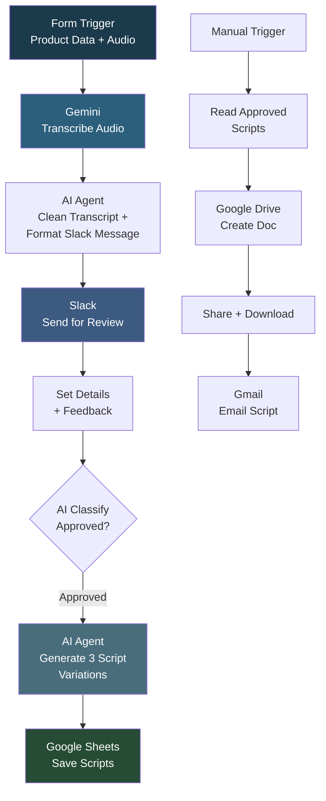

# My Workflow 25

## Overview

A TikTok Shop ad script generation pipeline with human-in-the-loop approval. It accepts ad performance data and an audio file of a video ad through a form, transcribes the audio using Gemini, cleans the transcript with AI, sends it to a Slack channel for copywriter review, classifies the feedback as approved or rejected, and if approved, generates 3 new ad script variations using AI. The scripts are saved to a Google Sheet, and approved scripts are converted to Google Docs, shared, and emailed to the team.

## How It Works

**Script Generation:**
```
Form (product, metrics, audio file) -> Gemini transcribe audio -> AI clean transcript + format Slack message -> Send to Slack for copywriter review -> Classify feedback (Approved/Rejected) -> If Approved: AI generates 3 script variations -> Save to Google Sheet
```

**Script Distribution:**
```
Manual Trigger -> Read approved scripts from Sheet -> Create Google Doc -> Share file -> Download -> Email with attachment
```

### Workflow Diagram



## Integrations

- **Google Gemini** - Audio transcription, transcript cleaning, feedback classification, and script generation
- **Slack** - Copywriter review and approval workflow
- **Google Sheets** - Script storage and tracking
- **Google Drive** - Script document creation and sharing
- **Gmail** - Script distribution via email

## Setup

1. Import `My_workflow_25.json` into your n8n instance.
2. Configure credentials for Google Gemini, Slack (OAuth2), Google Sheets, Google Drive, and Gmail.
3. Update the Slack channel ID and Google Sheet/Drive IDs.
4. Activate the workflow and submit the form with ad data.
